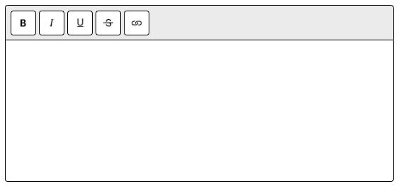

# ctreax (see-tricks) - my wygsiwyg editor for the site

#### just one insert and done

## setup:
```
<!-- script (ECMAScript 6) -->
<script src="https://cdn.jsdelivr.net/gh/kendoodoo/ctreax/min.vanilla.js"></script>

<!-- script (JQuery) -->
<script src="https://cdn.jsdelivr.net/gh/kendoodoo/ctreax/min.jquery.js"></script>

<!-- tag for editor -->
<ctreax color="whatever_color" controls="top,left,bottom,right whatever place"></ctreax>
```
